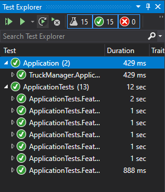

# Truck Manager

API para gerenciar o cadastro e registro de motoristas ao passar pelo terminal.

# Introdução

## Pré-requisitos

* [.NET Core SDK 2.2](https://dotnet.microsoft.com/download/dotnet-core/2.2)
* [MongoDB](https://www.mongodb.com/)

## Executar o projeto

Por padrão, a aplicação escutará as requisições na porta **5000**. Para alterar, é necessário mudar a **applicationUrl** no **launchSettings.json** localizado no **src/Api/Properties**.

A connection string do banco de dados está definida no arquivo **appsettings.json** (ou **appsettings.Development.json** se estiver em modo de desenvolvimento) na pasta **src/Api**.

```
Hosting environment: Development
Now listening on: http://localhost:5000
Application started. Press Ctrl+C to shut down.
```

### Linha de comando

```
dotnet run --project src/Api
```

### Docker

```
docker build -t [TAG_NAME] .
docker run -d [TAG_NAME]
```

Para mais informações de como construir uma imagem e rodar um container, [consultar a documentação oficial](https://docs.docker.com/get-started/).

## Documentação dos endpoints

Foi utilizado a biblioteca [Swashbuckle.AspNetCore](https://github.com/domaindrivendev/Swashbuckle.AspNetCore) para criar uma interface de documentação/interação com a API. Ao rodar o projeto em modo de desenvolvimento, é possível acessar uma listagem de todos os endpoints: **/swagger/index.html** (para mais informações, [consultar a documentação da Microsoft](https://docs.microsoft.com/pt-br/aspnet/core/tutorials/getting-started-with-swashbuckle?view=aspnetcore-2.2&tabs=visual-studio))

## Rodar os testes

Para rodar todos os testes, executar o comando abaixo na raíz do projeto:

```
dotnet test
```

Para executar somente os testes de integração, passar como argumento o caminho do projeto **src/ApplicationTests**.

No **Visual Studio**, é possível rodar todos os testes (ou selecioná-los inidividualmente) abrindo o **Test Explorer**.



# Licença

This project is licensed under the MIT License - see the [LICENSE.md](LICENSE.md) file for details
